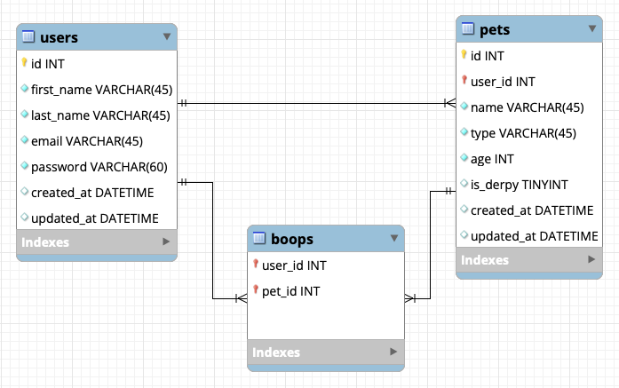
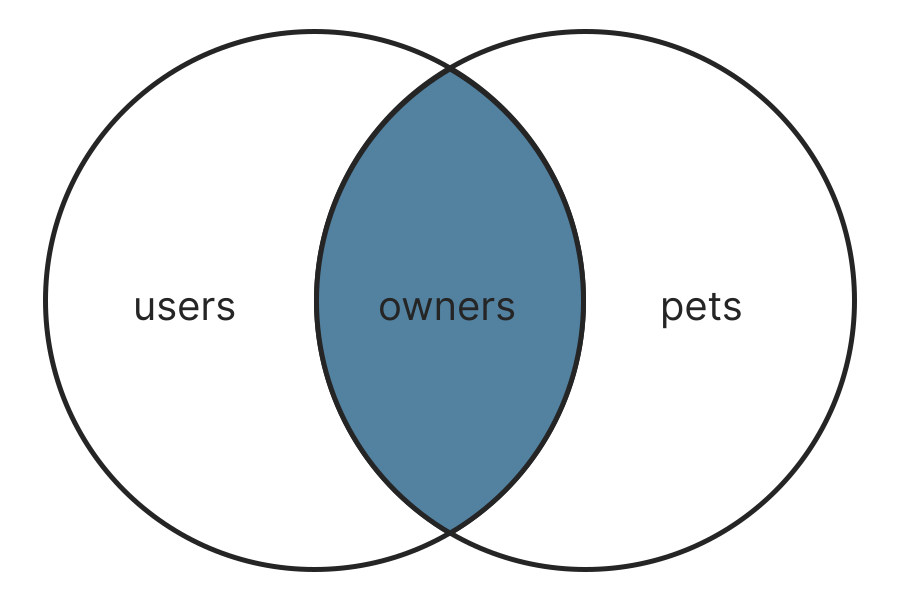
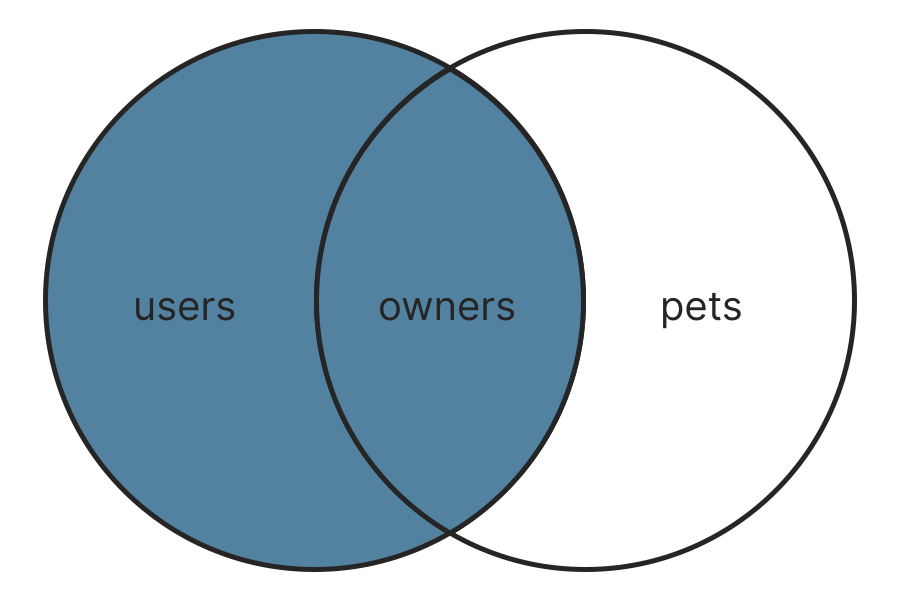

# Join Statements

There will be relationships between our tables in our schemas. One-to-many, and (if you're going for a black belt), many-to-many. Users will be able to create, read, update, and delete rows in our databases. Take the Boops website we made the ERD for yesterday, for example.



## `JOIN` (aka `INNER JOIN`)

Users can add their pets to the database. When they do, each pet in the database will have a foreign key (`user_id`) that matches the primary key (`id`) of the user who added it. This is a one-to-many relationship from `users` to `pets`.

Let's imagine that the Boops web application will have a dashboard that displays all pets in the pets table. We may also want to include the information of the owner of each pet.

In order to retrieve the owner's information of each pet, we will use a `JOIN` statement. We will query the pets table and join the users table on the matching columns.

```sql
SELECT * FROM pets
JOIN users
ON pets.user_id = users.id;
```

The above statement is selecting all the columns from both the pets table and the users table. The resulting rows will be joined on the matching columns -- the `user_id` column in the `pets` table, and the `id` column in the `users` table.

If a user exists in our database that **has not** added a pet, that user will not be included in the results.

Here's a Venn diagram of what that looks like.



Only the information of the pets and users with matching foreign keys and primary keys will be included in the results.

We can also amend this `JOIN` statement if we need the results of only one pet with its owner. We simply add a `WHERE` clause.

```sql
SELECT * FROM pets
JOIN users
ON pets.user_id = users.id
WHERE pets.id = 3;
```

## `LEFT JOIN`

Let's now take a look at the `LEFT JOIN` statement. Let's imagine that administrators of Boops should be able to see all the users in the database. Admins should see users and pets like above, but also users who have not yet added a pet.

This feature will require a `LEFT JOIN`.

```sql
SELECT * FROM users
LEFT JOIN pets
ON users.id = pets.user_id;
```

With the addition of the `LEFT` keyword, the results of this statement will now include all users, whether they have added a pet or not.

If we examine the Venn diagram of a `LEFT JOIN`, we see where its name comes from.



The first table in the statement is considered the "left" table.